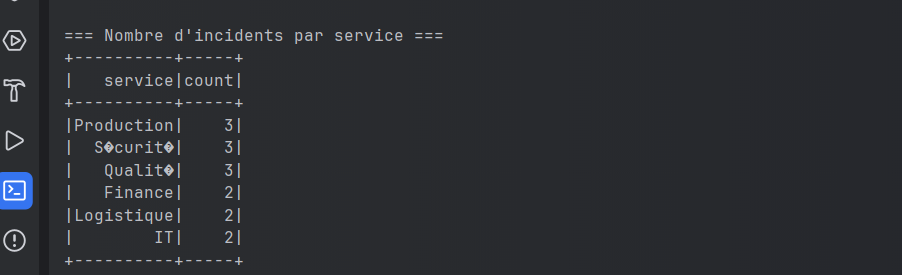
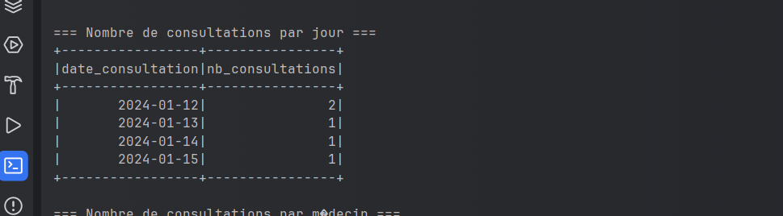

# Report: Data Processing with Apache Spark

**ENSET Mohammédia** | Big Data Processing 2024 | October 2025

---

  

---

This report presents two practical exercises on distributed data processing using Apache Spark.

## Exercise 1: Incident Processing

### Objective

Develop a Spark application to process incidents from each department of an industrial company.

### Tasks

1. Display the number of incidents per department
2. Display the two years with the most incidents

### Results

#### 1. Number of Incidents per Department

#### 2. Two Years with the Most Incidents

## Exercise 2: Hospital Data Processing

### Objective

Process hospital data stored in a MySQL database using Spark SQL.

### Database

- **Name:** DB_HOPITAL
- **Tables:** PATIENTS, DOCTORS, CONSULTATIONS

#### 1. Database Structure

#### 2. Number of Consultations per Day

**Figure 4:** Terminal Results

#### 3. Number of Consultations per Doctor

#### 4. Number of Distinct Patients per Doctor

## Conclusion

✅ **Both Spark applications have been successfully developed**

- Exercise 1: Industrial incident processing
- Exercise 2: Hospital data processing
- Java 21 compatibility
- Using Spark SQL for distributed analysis

---

**Course Instructor:** Mr. Abdelmajid BOUSSELHAM
